## Giacomo called me... 

> After Adam...

<!-- come to tech school to do an inspirational talk after Adam Back -->
<!-- after Adam a discouraging talk, not inspirational -->

<!-- slide pretty empty, AI help, two people talking over the phone  -->

## AI fails

{height=70%}

<!-- Ok I have to present after Adam, and it seems AI is not going to help -->

## Anno domini - 5-0 BS

<!-- Question, What's BS? Before Satoshi -->

- Computer Science Engineer
- Uninterested in finance
- No political affiliation
- Various job, consultancy in DW for insurance company

## Anno domini - 2-5 AS

- Break up <!-- Sparked some changes -->
- Quit smoking
- Start looking for stocks & co.
- Discover bitcoin <!-- Finally an affiliation to be proud of, to defend, to teach the world, so  -->
- Quit a job and startup (sigh) <!-- Just keep your boring job and buy coins stupid -->

## Geobit - 5 AS

<!-- 
This was my startup, never incorporated with this name
Explain what Geobit was about
Geobit stands for Geolocated bitcoins, 
sponsors drops bitcoins at a GPS locations because they want to sponsorize an event for example
-->

:::::::::::::: {.columns align=center}
::: {.column width="50%"}

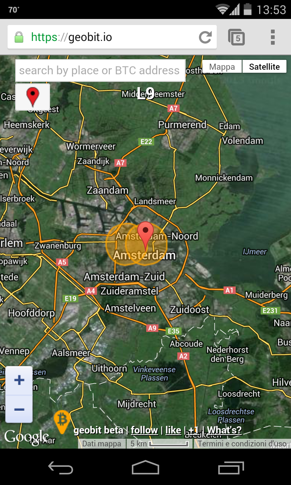{height=70%}

:::
::: {.column width="50%"}

- Fatal flaw <!-- Anybody can guess what the flaw was> -->
- [Jippy](https://bitcoinmagazine.com/culture/jippi-is-pok%C3%A9mon-go-for-bitcoin-) <!-- cycle and recycle, greg maxwell wrote about it in a bitcoin talk post in the 2013 -->

:::
::::::::::::::

<!-- Naive but discovered Startup World, built a network -->

## Amsterdam - 5 AS

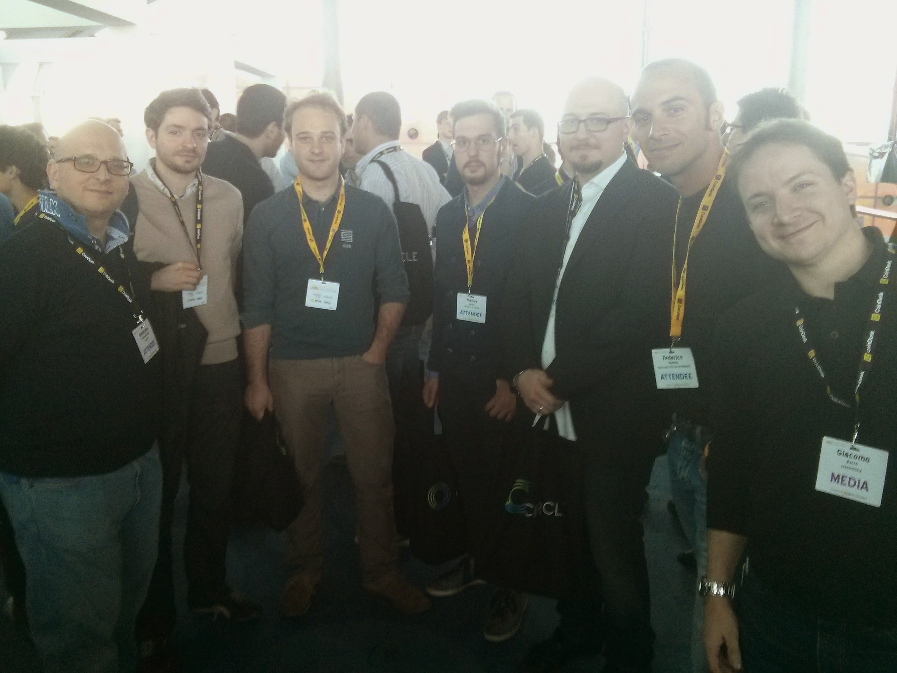{height=70%}

<!-- You can note Giacomo here, We met there, I am here because he called me. Build your network, it helps along the way-->
<!-- Other people, I think everyone here is in the bitcoin space -->
<!-- Ametrano, Cimatti, x, Bertani, Levrini, Pecoraro, Zucco -->
<!-- even if Geobit fail, network... -->

## Amsterdam - 5 AS

<!-- Who is the guy next to the hippie me? -->
<!-- At the time he was an Idol, the guy who received the ball from Satoshi -->
<!-- As the time went by I was a lot disappointed by gavin, keep the intellectual honesty to change your mind -->

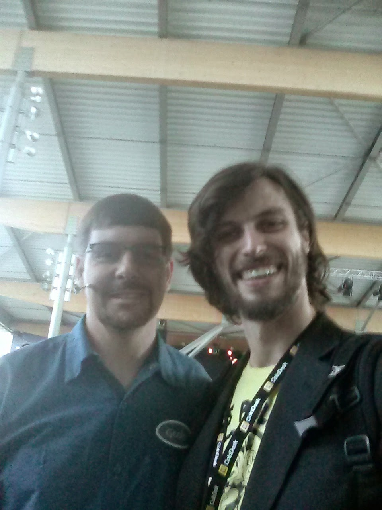{height=70%}

<!-- So I said there was a fatal flaw in Geobit  -->
<!-- I still didn't give up with the startup Idea, instead of taking corporate job and buing bitcoin... -->

## Next Startup

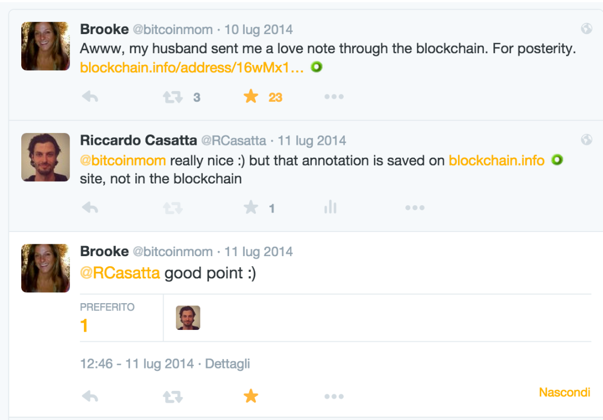{height=70%}

<!-- While still digesting geobit fatal flaw a tweet come to my attention... -->

## Next Startup

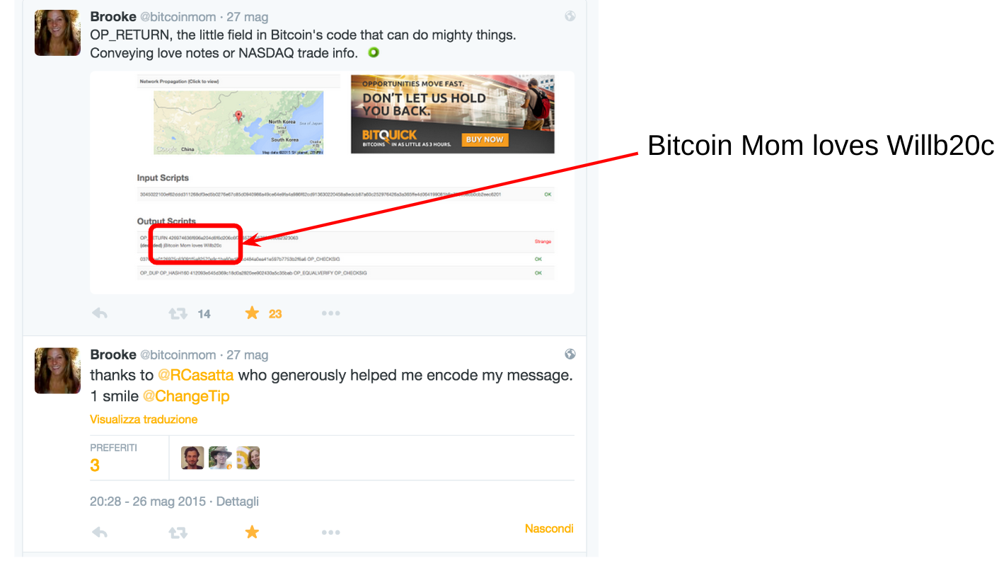{height=70%}

<!--
I was working with bitcoinj, java library from Mike Hearn, I regret having to do with Java, now I do only rust. So I created the tx which save the message for bitcoin mom really on the blockhchain.
This thing makes sense for everybody, I will build something to allow everyone to write in the blockchai
-->

## Eternity Wall - 6 AS

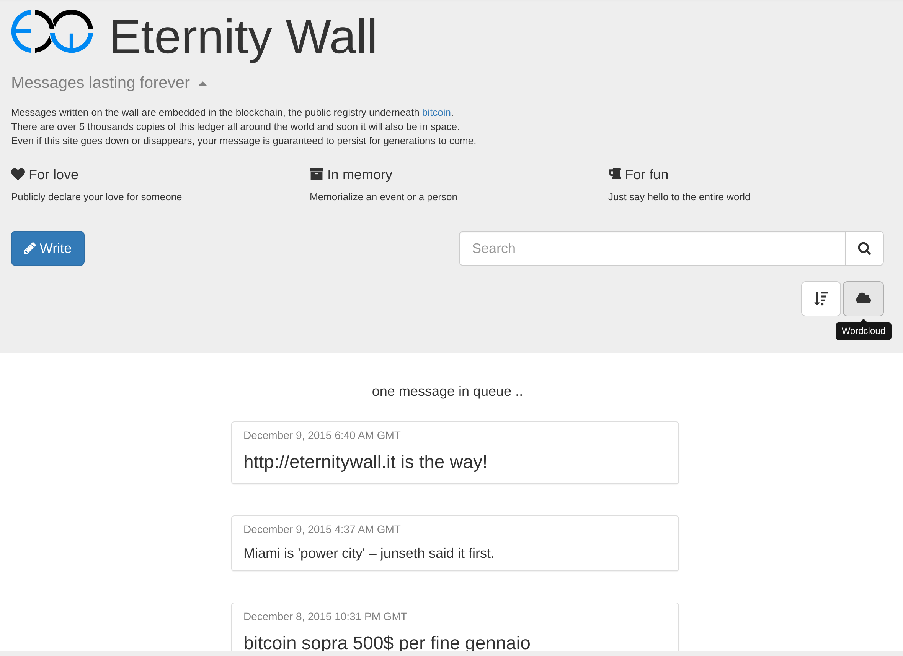{height=70%}

<!--
- EW born
- make easy to write, I was paying with my own bitcoins for txs, the site exploded
-->

## Eternity Wall 

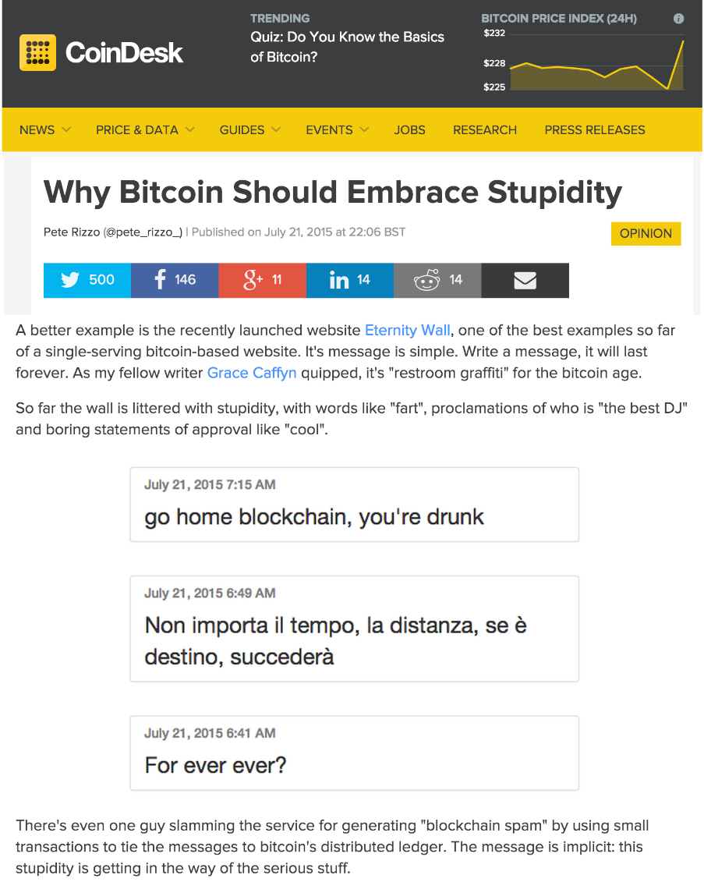{height=70%}

<!--
well taken by the news, something silly like the wall was needed to reach the masses
like the rabbits and cats images convinced everybody to connect to internet 
Most probably the project I am most famous for in the broad audience
-->

## Eternity Wall problems

- Where is the Business Model?
  - pay to write <!-- found this in my old slides I was showing to investors... The reality is that the blockchain remove third parties why people should pay ew to do this stuff?  --> 
  - pay to like
  - pay to answer
- Is this spam?
<!-- 
Blockchain space is scarce, is it worthy to write clear text on it instead of financial txs?
I was doing it in the most responsible way, OP_RETURN (Who knows the difference between writing it in an address?) However, I think the fee market is there as spam protection, bitcoin cannot be based on ethics, so if it pays the fee is mostly not spam, However, I was not super happy to facilitate this...

Inscription are doing today and very succesfull, I was wrong?
-->

## Timestamping

- Timestamping is more interesting than messages <!-- another turn -->
<!-- 
timestamping is giving a document (digital) a prior date of existance 
in ramson the seized person with a recent journal is proving the same thing,
-->
- Timestamping is incredibly scalable <!-- How so? hashing and merkle trees -->
- Eternity Wall introduced timestamping <!-- But Peter did it better, admit and join forces -->

## [OpenTimestamps](https::/opentimestamps.org) - 7 AS

:::::::::::::: {.columns align=center}
::: {.column width="50%"}

{height=40%}

:::
::: {.column width="50%"}

- Scalable
- Trust minimized
- Reliable
- Free

:::
::::::::::::::

## OpenTimestamps - Scalable

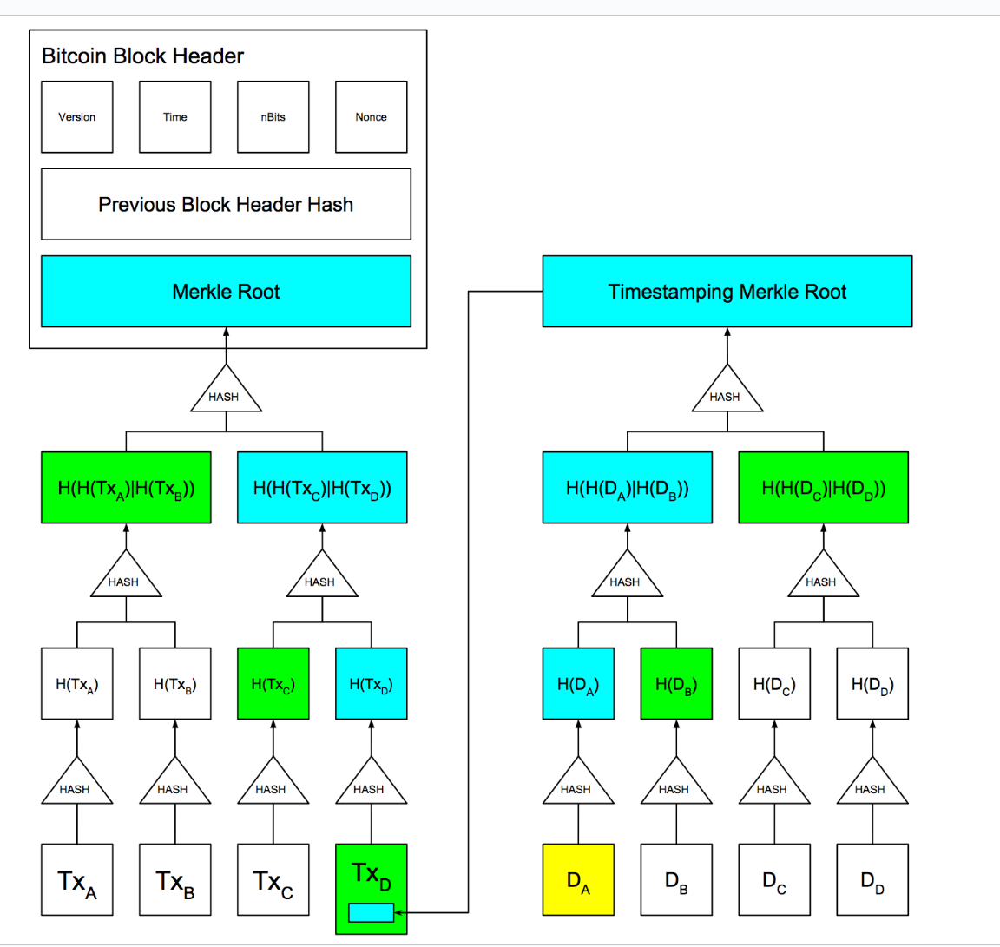{height=70%}

## OpenTimestamps - Trust minimized

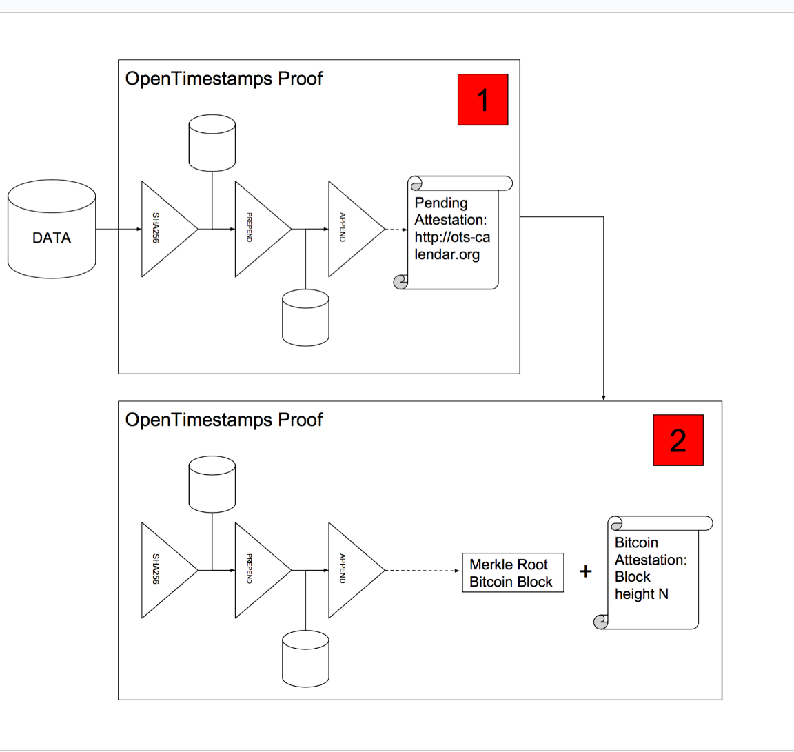{height=70%}

## OpenTimestamps - Trust minimized and reliable

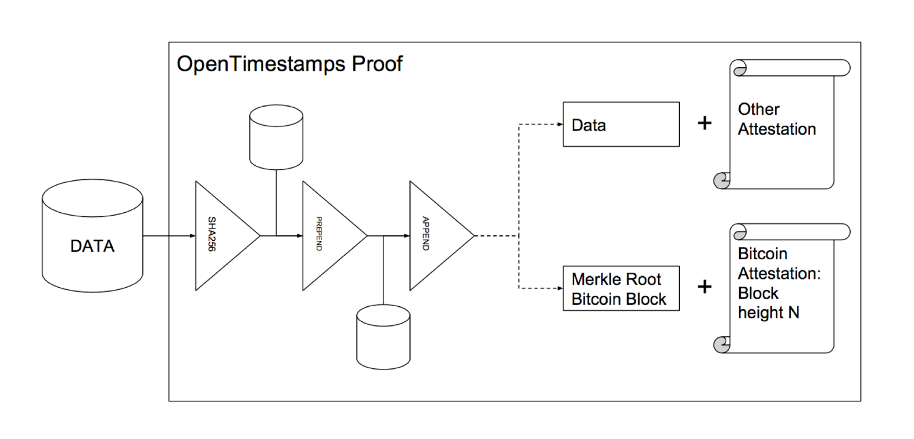{height=70%}

## OpenTimestamps - Successes

- Timestamped the internet* <!-- how so? including github -->
- Used in Guatemala elections
- Millions of stamps <!-- Impossible to say how many -->

## Scaling Bitcoin - 7 AS

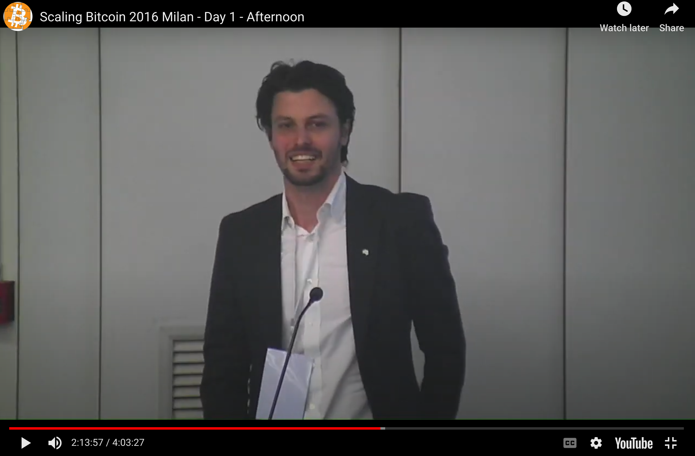{height=70%}

<!-- Presenting scalable timestamping and differences between Ots and Chainpoint, even though I was pretty a fan of OTS much more than Chainpoint -->

<!-- thanks to the world audience of scaling and the magic of timestamping -->

## Rich?

{height=70%}

## ...Not really

EternityWall was making consultancy

Business making money:

- Exchanges
- Stablecoin issuers
- Mining <!-- bitmain asic boost, producer presell and didn't delivered in time  -->
- Hardware wallet <!-- limited by niche, and by hardware itslef -->
- Owning bitcoins + finance product (Microstrategy)
- Payment processors?
- Scam (altcoins, nfts...)
- Be smarter than me

Employee:

- Today more choice (github presence)

## Blockstream - 9 AS

<!-- Decided to focus on the technical aspect instead of the entraponerial one -->

- EW Team (4) joined BS <!-- Proud none of my team was left behind -->
- Work on the Green Wallet <!-- Front-end Android, then backend and GDK libray -->
- After a couple of years some disagreement... <!-- Be careful doing quick choice-->

<!-- GDK great principle, doing once the hard bitcoin part, use it in multiple app, but execution lacked IMO -->

## Square/Spiral - 11 AS

<!-- What is a Grant? Take money to work on something open sourcebitcoin without a manager -->

 - BDK - Bitcoin Development Kit <!-- Like GDK at blockstream but done right -->
 - [Fee estimation](https://bitcoindevkit.org/blog/2021/01/fee-estimation-for-light-clients-part-1/) with machine learning  <!-- fee estimation interesting because it's very hard to do it in a light client in trustless fashion -->

## Back in Blockstream

- Thank you sabbatical, I kept my options
- better situation on different project like [LWK](https://github.com/blockstream/lwk) <!-- BDK for liquid -->
- Almost no speech, family <!-- Speech stress my out, and without startup why should I do that, now I miss -->

## Active side projects

- [General purpose offline signer](https://github.com/RCasatta/firma2) (3rd rewrite...)
- [FBBE](https://fbbe.org)
- OpenTimestamps calendar [finney](https://finney.calendar.eternitywall.com/) 
- Bitcoin rust libraries <!-- Rust is the best language -->
  - rust-bitcoin maintainer
  - Blocks iterator (opreturn.org, eternitywall.it)
  - bitcoin slices
  - rust crate bitcoind/electrsd/elementsd series

## My bitcoin journey

{height=70%}
