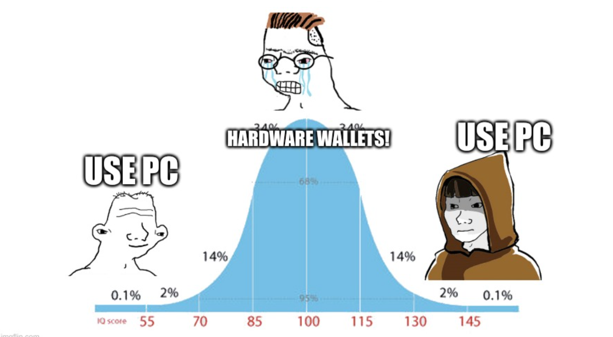
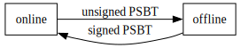
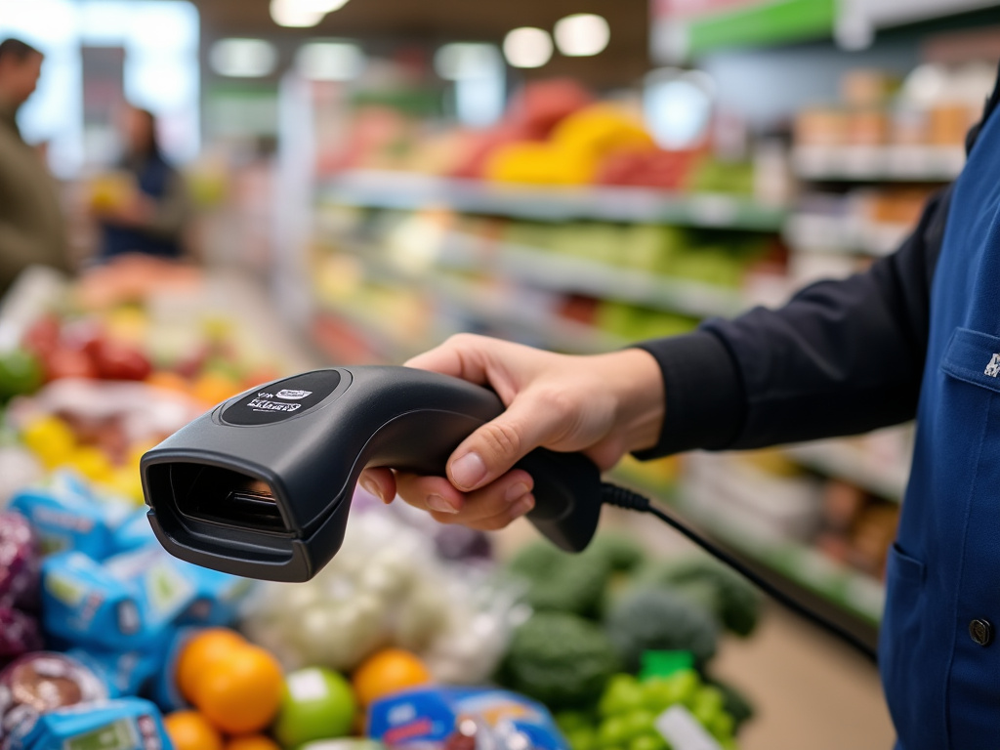
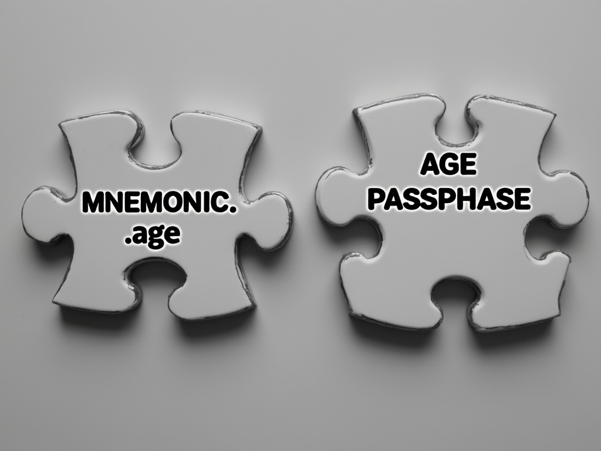
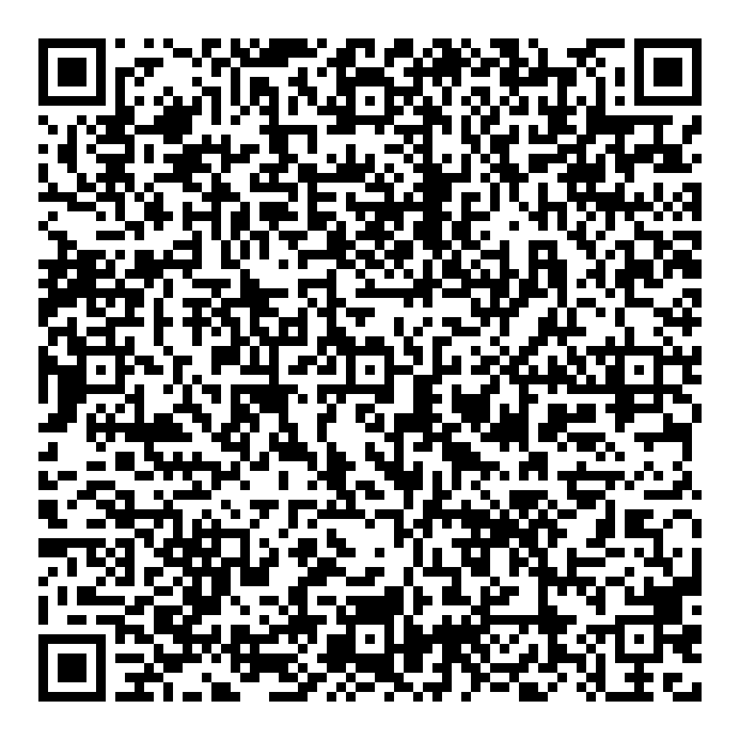
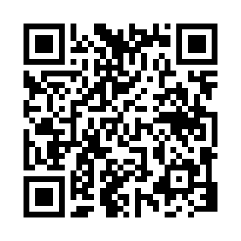
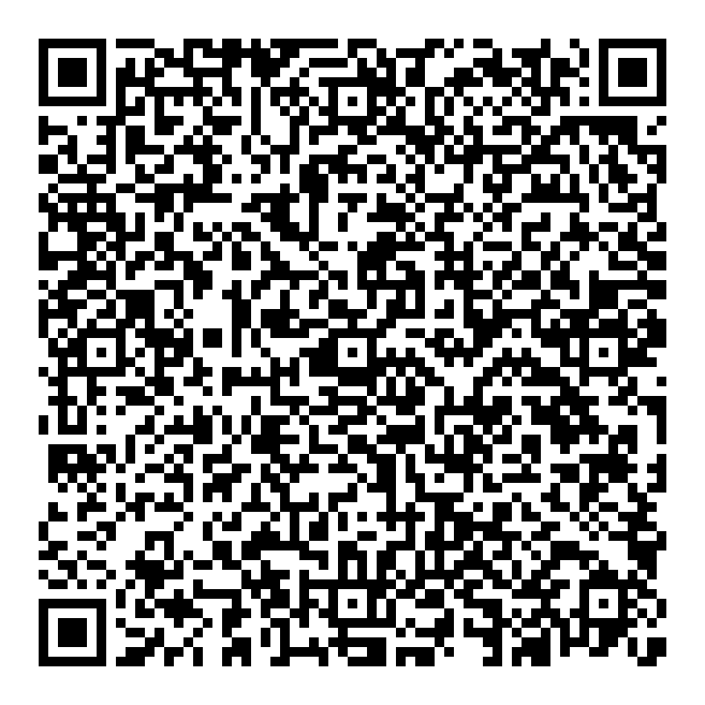
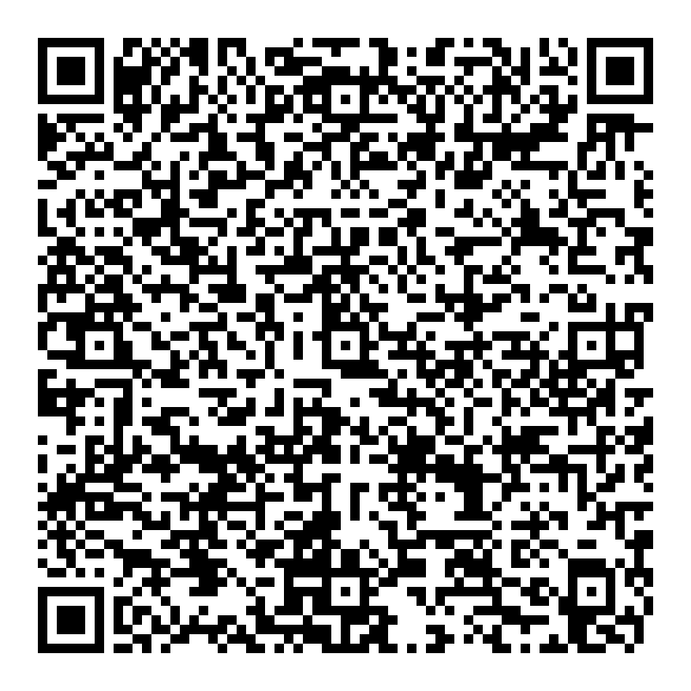

## How do you make transactions?

<!--
vale piu' un Meme di mille parole
Solo self-custody
Stolto, online, intersezione self-custody/questo minima
Most HWW, dispositivo separato, no direct connection, ridotta superficie, assunzione app compromessa
Jedi usa pc, sara' solo lo stolto incappucciato
-->


           
## General purpose offline signing



<!--
HWW principle
online watch only
offline differenza general purpose
-->

## The problem

How to transfer information?

* Unclear [greg tutorial](https://gist.github.com/jashmenn/9811205)
* keyboard <!-- mooolto scomodo -->
  * [glacier](https://glacierprotocol.org/)
  * [rusty's protocol](https://github.com/rustyrussell/bitcoin-storage-guide)
* cable (usb/ethernet) <!-- il punto non era non essere connessi -->
* radio (blueetoth/wifi) <!-- ancora peggio -->
* memory (sd card) <!-- non connesso ma tanta banda, plug&play -->
* animated QR codes <!-- custom software / infinite bandwith -->

<!-- minimizzare quanto possibile banda, massimizzare user experience -->

## Solution

{height=70%}

<!-- La soluzione ce la da' la cassiera dell'esselunga (Migros)  -->

## Comparison

Feature         | Hardware wallet | GP offline signing
----------------|:---------------:|:-----------------:
User experience | \checkmark      | <!-- Even though the barcode scanner... :) -->
Review          | \checkmark      | <!-- ATM almost delirio di un singolo -->
Cost            |                 | \checkmark <!-- supposing to have spare devices...-->
Accountability  |                 | \checkmark <!-- Meaning a raspberry is not meant for bitcoin, evil maid recognize the hww not the pc -->
Centralization  |                 | \checkmark <!-- Mexican scam of hardware producer, deterministic signing /timing --> 
Flexibility     |                 | \checkmark <!-- For example sign a bunch of presigned nlocktimed tx -->

## Tools

- [firma2](https://github.com/RCasatta/firma2) - PSBT signer 
  - `derive`
  - `sign`
  - `addresses`
- [multiqr](https://github.com/RCasatta/multiqr) - QR codes <!-- like qrencode but split -->
- [age](https://github.com/FiloSottile/age) - Encryption tool <!-- Why not GPG -->
- [bitcoin core](https://github.com/bitcoin/bitcoin) - Node/Wallet watch-only
- [nix](https://nixos.org) - Packaging and more <!-- Nix mondo ma nocciolo dipendenza indicizzata per hash -->

## Nix - VM

### Run

```
git clone https://github.com/RCasatta/firma2
cd firma2/vm
nix run .#vm
```

## Nix - Physical


### Create image

```
git clone https://github.com/RCasatta/firma2
cd firma2/build-raspi4-image
nix build .#image.rpi4
```

### Burn on the key

```
sudo pv result/sd-image/nixos-sd-image-...img \
  -Yo /dev/disk/by-id/usb-MXT-USB_Storage_Device_-0:0
```

## Split mnemonic

{height=60%}

<!-- 
AI Fail:
- pezzi non si incastrano
- errori ortografici
- bordi non present
-->
<!-- perche' separata, non singolo posto, composta minor tempo possibile -->
<!-- Out of scope come creare la mnemonica... codex32... -->

Out of scope how to generate the mnemonic, the coolest way is [codex32](https://www.secretcodex32.com/)

---

{height=70%}

<!-- input the mnemonic in clear text, save it encrypted -->
```
cat - | age -e -p -o MNEMONIC.age
cat MNEMONIC.age | base32 | multiqr --bmp MNEMONIC.age.bmp 
```
<!-- put the encrypted mnemonic in a QR -->

---

{height=70%}

```
cat - | multiqr --bmp AGE_PASSPHRASE.bmp
```

## Create descriptors (offline)

### Offline

```sh
vim MNEMONIC.age # scan QR code
export NETWORK=signet

export DESCRIPTOR=$(cat MNNEMONIC.age | age -d | derive | \
  jq -r .singlesig.bip86_tr.multipath)

```

### Online

```sh
export IMPORT=$(cat MNNEMONIC.age | age -d | derive | \
  jq -r .singlesig.bip86_tr.import_descriptor)
```

## Bitcoin core (online)

```sh
alias bcli="bitcoin-cli --chain=signet -named"

bcli createwallet wallet_name=lugano blank=true \
     disable_private_keys=true

bcli importdescriptors $IMPORT

bcli getnewaddress address_type=bech32m

bcli walletcreatefundedpsbt \
inputs='[{"txid":"2e6425eb67549e638503d541fb1e1fb64f01a5d7dd7571a8ed78fac9a689aafe","vout":0}]' \
outputs='[{"tb1pvsdpz8cucqz4tylmgtemn2qp6l9e8mptn36emnd6w6ntz8p8yp3s69gc7q":0.0001}]' \
| tee psbt_json
```

---

{height=70%}

```
cat psbt_json | jq -r .psbt | multiqr --qr-version 10
```
---

{height=70%}

## Sign (offline)

```sh

vim psbt # scan QR code
cat MNEMONIC.age | age -d | sign psbt | tee result
```

## Broadcast (online)

```sh
vim tx # scan QR code
bitcoin-cli sendrawtransaction $(cat tx)
```

